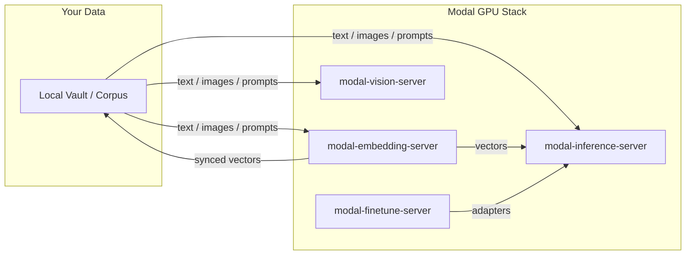

# Modal Embedding System


[](https://github.com/sponsors/kylebrodeur)

A comprehensive GPU-accelerated stack for embedding large-scale corpora, evaluating model performance, and syncing vectors to local clients.

This repository is organized into three specialized pillars to move you from "guessing" to "deployed."


### 1. Research (`/research`) — Generate
**Goal:** Create high-quality synthetic datasets to test your retrieval.
- **Synthetic Query Generation:** Uses large instruct models (like Qwen3) on Modal GPUs to generate human-like search queries for your documents.
- **Workflow:** Point the generator at your corpus $\rightarrow$ Generate a `{query, relevant_id}` dataset $\rightarrow$ Feed into the Eval pillar.

### 2. Eval (`/eval`) — Validate
**Goal:** Use a rigorous, data-driven approach to pick the best embedding model.
- **Retrieval Benchmarking:** Run recall@k and MRR tests against your real data.
- **Model Comparison:** Compare different models (e.g., EmbeddingGemma vs. BGE-M3) to find the optimal balance of dimension, latency, and accuracy for your specific domain.
- **Outcome:** A deterministic decision on which model to use for your production server.

### 3. Server (`/server`) — Deploy
**Goal:** High-performance production hosting of your chosen model.
- **GPU-Backed Embeddings:** Low-latency `/embed` for on-demand requests and a robust `/jobs` system for bulk re-indexing.
- **The Sync Protocol:** The "Killer Feature." Instead of managing massive vector files, the server uses a monotonic watermark to stream incremental updates to local clients.
- **Offline-First:** Sync vectors down to a local LanceDB store so your search remains instant and private.

---

## Quick Start: The "Flight Path"

### Step 1: Research & Eval (Picking your Model)
If you aren't sure which model to use:
1. Deploy the `research/datagen.py` tool to generate a benchmark dataset from your notes.
2. Run the `eval/run_eval.py` harness to test candidate models against that dataset.
3. Pick the winner (e.g., `embeddinggemma` @ 768-dim).

### Step 2: Deploy the Server
Once you have your model:
```bash
uvx modal deploy server/app.py
```

### Step 3: Configure Secrets
```bash
uvx modal secret create embedding-auth TOKEN=your_secure_token
uvx modal secret create huggingface-secret HF_TOKEN=your_hf_token
```

### Step 4: Sync to your Client
Set your `remoteUrl` in your client and run the sync process to pull your vectors down to your local machine.

## Server API Summary

All routes except `/health` and `/models` require `Authorization: Bearer <TOKEN>`.

| Method | Path | Purpose |
| :--- | :--- | :--- |
| `GET` | `/health` | Health check and default model info. |
| `GET` | `/models` | Registry of available embedders and dimensions. |
| `POST` | `/embed` | Get vectors for a list of texts (on-demand). |
| `POST` | `/jobs` | Submit a bulk embedding job (records, file, or re-embed). |
| `GET` | `/jobs/{id}` | Poll for bulk job progress and status. |
| `GET` | `/sync/export`| Stream vectors for a collection since a specific watermark. |
| `GET` | `/stats` | Get table sizes and GPU utilization. |

## Server Configuration

The server is fully configurable via environment variables (prefixed with `MODAL_EMBED_`):

- `MODAL_EMBED_DEFAULT_MODEL`: Canonical model to use (default: `embeddinggemma`).
- `MODAL_EMBED_DEFAULT_DIM`: Output dimension (default: 768).
- `MODAL_EMBED_GPU`: Set to `""` for CPU, or specify a GPU type (e.g., `L4`).
- `MODAL_EMBED_VECTORS_VOLUME_VERSION`: Must be `2` for LanceDB stability.

## Examples

See [`examples/`](examples/) for a minimal, stdlib-only client (`embed_example.py`) you can copy directly into your own stack.

## Contributing

See [CONTRIBUTING.md](CONTRIBUTING.md) for ground rules and workflow.

---

---

Built by [Kyle Brodeur](https://kylebrodeur.com) · Model-selection deep-dive: [Choose the Right Embedding Model for Your Data](https://kylebrodeur.substack.com/p/choose-embedding-model-for-your-data)

## Part of the Modal Toolkit

Four standalone Modal utilities from the same author, each extractable and deployable on its own.

- **[modal-inference-server](https://github.com/kylebrodeur/modal-inference-server):** OpenAI-compatible LLM inference with hot-set routing and scale-to-zero.
- **[modal-vision-server](https://github.com/kylebrodeur/modal-vision-server):** Specialized vision classification (BioCLIP-2) with adaptive SAM 2.1 segmentation.
- **[modal-finetune-server](https://github.com/kylebrodeur/modal-finetune-server):** Profile-driven LoRA fine-tune and GGUF pipeline with an honest eval gate.

## Ecosystem Flowchart



## License

Apache-2.0 — see [LICENSE](LICENSE).
